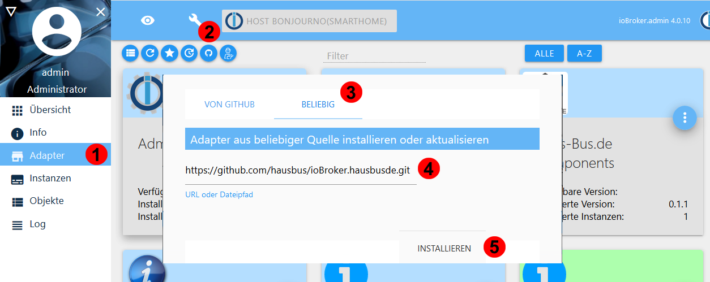

# iobroker.hausbusde
IO Broker Adapter that supports all haus-bus.de components.<br>
For a documentation about the supported hardware and IO Broker integration please check<br>www.haus-bus.de/iobroker

## Installation
<!--You can either install the adapter via the ioBroker web interface or on your local machine via npm.-->
This adapter is actually in pilot phase and not yet included in the official ioBroker catalog. If you are facing any problems or bugs please contact info@haus-bus.de<br>
The adapter can be installed from GIT in the following way:<br>

<br>
1: Choose Adapter<br>
2: Choose icon "Install from own source"<br>
3: Choose "From any destination" <br>
4: Enter url: https://github.com/hausbus/ioBroker.hausbusde.git <br>
5: Click "Install" <br>

<!--
### Browser-based
1. Open your ioBroker web interface in a browser (eg: 192.168.30.70:8081)
2. Click on Tab "Adapters"
3. Type "hausbusde" in the Filter
4. Click on the three points and then on the "+" symbol of the HausBusDe adapter

### Local machine
Navigate into your iobroker folder and execute the following command: 
```bash
npm i iobroker.denon
```-->

## Setup
The HausBusDe adapter is ready to use without further configurations. It is automatically searching for haus-bus.de components using UDP broadcast requests. Its mandatory to have at least one haus-bus.de component with a network interface (for example any relay module) that is connected to the same network like io broker. Any further components can be connected by RS485 to the module with ethernet gateway.

<br>
<br>
<br>

## Changelog
### 0.1.4 (2020-09-12)
* (hausbusde) fixed invalid string value for relay events

### 0.1.3 (2020-09-11)
* (hausbusde) supporting lan bridge

### 0.1.2 (2020-09-06)
* (hausbusde) first public version


## License
The MIT License (MIT)

Copyright (c) 2020 Hermann Höschen <info@haus-bus.de>

Permission is hereby granted, free of charge, to any person obtaining a copy
of this software and associated documentation files (the "Software"), to deal
in the Software without restriction, including without limitation the rights
to use, copy, modify, merge, publish, distribute, sublicense, and/or sell
copies of the Software, and to permit persons to whom the Software is
furnished to do so, subject to the following conditions:

The above copyright notice and this permission notice shall be included in
all copies or substantial portions of the Software.

THE SOFTWARE IS PROVIDED "AS IS", WITHOUT WARRANTY OF ANY KIND, EXPRESS OR
IMPLIED, INCLUDING BUT NOT LIMITED TO THE WARRANTIES OF MERCHANTABILITY,
FITNESS FOR A PARTICULAR PURPOSE AND NONINFRINGEMENT. IN NO EVENT SHALL THE
AUTHORS OR COPYRIGHT HOLDERS BE LIABLE FOR ANY CLAIM, DAMAGES OR OTHER
LIABILITY, WHETHER IN AN ACTION OF CONTRACT, TORT OR OTHERWISE, ARISING FROM,
OUT OF OR IN CONNECTION WITH THE SOFTWARE OR THE USE OR OTHER DEALINGS IN
THE SOFTWARE.
